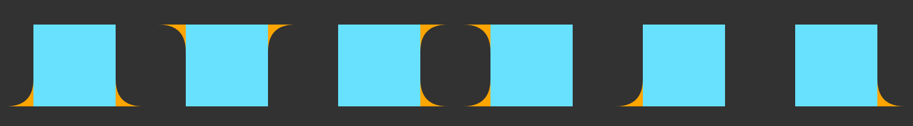

# Negative Borders

## Install
```
# npm
npm i negative-borders

And then you can just use

import "negative-borders"

# cdn
<script src="https://cdn.jsdelivr.net/npm/negative-borders@1/negative-borders.js"></script>
```

## Examples



```html
<div class="box" data-negative-borders data-negative-borders-size="50px" data-negative-borders-color="orange"></div>
<div
  class="box"
  data-negative-borders
  data-negative-borders-size="50px"
  data-negative-borders-color="orange"
  data-negative-borders-position="top"
></div>
<div
  class="box"
  data-negative-borders
  data-negative-borders-size="50px"
  data-negative-borders-color="orange"
  data-negative-borders-position="right"
></div>
<div
  class="box"
  data-negative-borders
  data-negative-borders-size="50px"
  data-negative-borders-color="orange"
  data-negative-borders-position="left"
></div>

<div
  class="box"
  data-negative-borders
  data-negative-borders-size="50px"
  data-negative-borders-color="orange"
  data-negative-borders-show-after="false"
></div>
<div
  class="box"
  data-negative-borders
  data-negative-borders-size="50px"
  data-negative-borders-color="orange"
  data-negative-borders-show-before="false"
></div>
```
